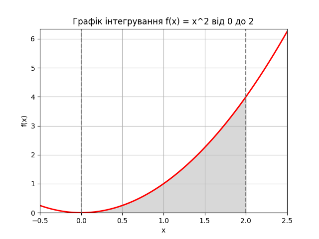

# goit-algo-hw-10
Linear programming and randomized algorithms

**Завдання 1. Оптимізація виробництва**
======================================================================================

Код створеної програми, з використання бібліотеки PuLP, максимізує загальну кількість продуктів "Лимонад" та "Фруктовий сік", враховуючи обмеження на кількість ресурсів.

**Результат**
--------------
Оптимальна кількість 'Лимонаду': 30.0
Оптимальна кількість 'Фруктового соку': 20.0
Максимальна загальна кількість продуктів: 50.0

**************************************************************************************
**************************************************************************************
**************************************************************************************

**Завдання 2. Обчислення визначеного інтеграла**
======================================================================================

**Результати програмного пошуку визначеного інтеграла**
-------------------------------------------------------

1. Тестові значення інтеграла обчислені методом Монте-Карло при різній кількості випадкових точок (N):

N=1000: 2.936

N=10000: 2.6024

N=100000: 2.66536

2. Значення інтеграла обчислене за допомогою функції quad: 2.666666666666667

**Висновки**
--------------------------------------------------------------------------------------

* Обчислені тестові значення інтеграла за допомогою метода Монте-Карло, при різній кількості випадкових точок (N = 1000, 10000, 100000), близькі до значення обчисленого за допомогою функції quad, що загалом свідчить про доволі високу точність методу Монте-Карло. 

* Точність методу Монте-Карло зростає зі збільшенням кількості випадкових точок, це твердження випливає при порівнянні результатів тестових обчислень значення інтеграла цим методом.

* Метод Монте-Карло може бути ефективним інструментом для чисельного інтегрування.